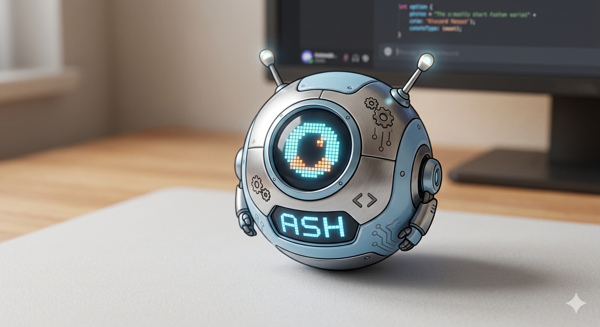

# 🔥 Ash Bot



A self-hosted Discord AI bot with a real personality, long-term memory, and tool-calling capabilities — powered by [Ollama](https://ollama.com) running locally on your machine.

> Built on .NET 10 / C# + Discord.Net. No cloud AI APIs required.

> *"The difficult we do immediately. The impossible takes a little longer."*

> *"Those who say it cannot be done should not interrupt the person doing it."* — George Bernard Shaw

---

## Features

- 💬 **Natural conversation** — responds in your Discord channel with a consistent personality
- 🧠 **Long-term memory** — remembers people, projects, and events across sessions (`memories.json`)
- 🔧 **20 tools** — web search, deep research, YouTube Music, file ops, code execution, reactions, DMs, and more
- 🤖 **Autonomous initiative** — speaks unprompted based on a configurable interval
- 🦙 **Runs on Ollama** — any local model works; ships with `ssfdre38/gemma4-turbo` as default
- 🧬 **Editable personality** — everything Ash is lives in `personality/` — change it to make her yours

---

## Requirements

- [.NET 10 SDK](https://dot.net/download)
- [Ollama](https://ollama.com/download) (auto-installed by setup script if missing)
- A Discord bot token ([how to create one](#creating-a-discord-bot))

---

## Quick Start

### Windows

```bat
git clone https://github.com/YOUR_USERNAME/ash-bot
cd ash-bot
setup.bat
```

Edit `appsettings.json`, then:

```bat
start-ash.bat
```

### Linux / macOS

```bash
git clone https://github.com/YOUR_USERNAME/ash-bot
cd ash-bot
chmod +x setup.sh start-ash.sh
./setup.sh
```

Edit `appsettings.json`, then:

```bash
./start-ash.sh
```

On first launch, Ash will automatically pull the default model (`ssfdre38/gemma4-turbo`) if it isn't already installed. This is a one-time download.

---

## Configuration

Copy `appsettings.example.json` to `appsettings.json` and fill in your values:

```json
{
  "Ash": {
    "DiscordToken":  "YOUR_DISCORD_TOKEN_HERE",
    "ChannelId":     "YOUR_CHANNEL_ID_HERE",
    "GuildId":       "YOUR_GUILD_ID_HERE",
    "AdminUserId":   "YOUR_DISCORD_USER_ID_HERE",
    "OllamaModel":   "ssfdre38/gemma4-turbo",
    "OllamaUrl":     "http://localhost:11434",
    "MaxHistory":    10,
    "InitiativeIntervalHours": 4
  }
}
```

| Field | Description |
|-------|-------------|
| `DiscordToken` | Your bot's token from the Discord Developer Portal |
| `ChannelId` | The channel Ash should live in (right-click → Copy Channel ID) |
| `GuildId` | Your server ID (right-click server → Copy Server ID) |
| `AdminUserId` | Your Discord user ID — grants you file/system tool access |
| `OllamaModel` | Any Ollama model name — swap to `llama3.2`, `mistral`, etc. |
| `OllamaUrl` | Ollama address — change if running Ollama on another machine |
| `InitiativeIntervalHours` | How often Ash speaks unprompted (0 to disable) |

All values can also be set via environment variables:

```
ASH_DISCORD_TOKEN, ASH_OLLAMA_MODEL, ASH_OLLAMA_URL,
ASH_CHANNEL_ID, ASH_GUILD_ID, ASH_ADMIN_USER_ID
```

---

## Using a Different Model

Any model available on [ollama.com/library](https://ollama.com/library) works. Just change `OllamaModel` in `appsettings.json`:

```json
"OllamaModel": "llama3.2"
```

Ash will auto-pull it on next startup if it isn't installed. Tool-calling works best with models that support it natively (Llama 3.x, Qwen 2.5, Gemma 3/4).

---

## Customizing Ash's Personality

All personality files live in the `personality/` folder:

| File | Purpose |
|------|---------|
| `soul.json` | Core identity, voice, traits, boundaries |
| `identity.json` | Name, pronouns, runtime info |
| `USER.md` | Who you are — Ash uses this to understand her admin |
| `ABILITIES.md` | Tool reference Ash reads to know what she can do |

Edit these to make Ash your own. She reads them at startup and after a `reboot_ash` tool call.

---

## Creating a Discord Bot

1. Go to [discord.com/developers/applications](https://discord.com/developers/applications)
2. **New Application** → give it a name
3. **Bot** tab → **Reset Token** → copy the token into `appsettings.json`
4. Enable **Message Content Intent** under Privileged Gateway Intents
5. **OAuth2 → URL Generator**: scopes = `bot`, permissions = `Send Messages`, `Read Messages/View Channels`, `Add Reactions`, `Read Message History`
6. Open the generated URL to invite the bot to your server
7. Enable **Developer Mode** in Discord settings to copy IDs (right-click)

---

## What Gets Stored Locally

| File | Contents | In git? |
|------|----------|---------|
| `appsettings.json` | Your tokens and IDs | ❌ gitignored |
| `memories.json` | People + community memory | ❌ gitignored |
| `ash_codex.db` | Knowledge codex (SQLite) | ❌ gitignored |
| `ash-workspace/` | Ash's personal file scratchpad | ❌ gitignored |

All sensitive data stays on your machine. Nothing is sent to any external service except Discord (messages) and Ollama (running locally).

---

## Project Layout

```
ash-bot/
├── AI/                  # Ollama HTTP client
├── Bot/                 # Discord event handling, message loop
├── Codex/               # SQLite knowledge store
├── Memory/              # memories.json read/write
├── State/               # Circuit breaker, autonomous queue, state tracker
├── Tools/               # All 20 tool implementations
├── personality/         # Ash's soul, identity, and abilities (edit these!)
├── appsettings.example.json
├── setup.bat / setup.sh
└── start-ash.bat / start-ash.sh
```

---

## License

MIT

---

*Built by someone who does the things people say can't be done — on hardware that wasn't supposed to do it.*
